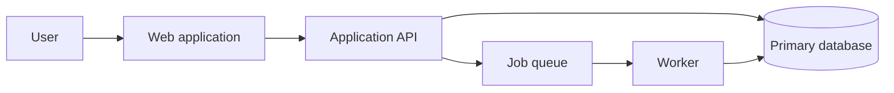

The best architecture is not only correct. It is *legible*. A new engineer should be able to trace a request, understand where decisions happen, and predict the effect of a change without relying on institutional memory.

This does not require elaborate documentation. It requires the code, runtime boundaries, and written material to tell the same story.

## Start with the path of a request

Before naming services or choosing infrastructure, draw the shortest honest path through the system.



That diagram creates useful questions immediately:

- Which operations must finish before the response?
- Which work can fail independently?
- Where is state authoritative?
- What does the user see when the worker is delayed?

## Make boundaries visible

A module boundary should represent a meaningful change in responsibility. A folder called `utils` usually says very little. A folder called `billing-ledger` gives the reader a model of the domain.

```ts
export interface LedgerEntry {
  accountId: string;
  amountInCents: number;
  occurredAt: Date;
}

export function recordEntry(entry: LedgerEntry) {
  // The implementation owns persistence and invariant checks.
}
```

The same principle applies to APIs. Prefer contracts that expose intent over endpoints shaped around database tables.

## Keep a small operational map

Every production system needs a short answer to these questions:

| Question | Useful answer |
| --- | --- |
| Is it healthy? | A small set of service-level signals |
| What changed? | Deploy and configuration history |
| Where did it fail? | Structured logs with request correlation |
| Who owns it? | A named team or person |

The map should fit on one page. If it cannot, the system may be asking operators to hold too much context at once.

## Documentation is part of the interface

Keep durable explanations close to the code they describe. Record decisions that would otherwise be surprising, and delete guidance when it stops being true.

> Good documentation reduces the number of facts a person must guess correctly.

Architecture becomes easier to maintain when its shape is visible in names, contracts, diagrams, and runtime behavior. The goal is not a system with no complexity. The goal is a system that makes its complexity inspectable.
