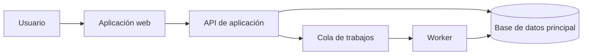

La mejor arquitectura no solo es correcta. También es *legible*. Una persona nueva en el equipo debería poder seguir una solicitud, entender dónde se toman las decisiones y predecir el efecto de un cambio sin depender de la memoria institucional.

Esto no exige documentación extensa. Exige que el código, los límites de ejecución y el material escrito cuenten la misma historia.

## Comienza por el recorrido de una solicitud

Antes de nombrar servicios o elegir infraestructura, dibuja el recorrido más corto y honesto a través del sistema.



Ese diagrama genera preguntas útiles de inmediato:

- ¿Qué operaciones deben terminar antes de responder?
- ¿Qué trabajo puede fallar de manera independiente?
- ¿Dónde vive el estado autoritativo?
- ¿Qué ve la persona usuaria cuando el worker se retrasa?

## Haz visibles los límites

El límite de un módulo debe representar un cambio significativo de responsabilidad. Una carpeta llamada `utils` suele decir muy poco. Una carpeta llamada `billing-ledger` ofrece un modelo del dominio.

```ts
export interface LedgerEntry {
  accountId: string;
  amountInCents: number;
  occurredAt: Date;
}

export function recordEntry(entry: LedgerEntry) {
  // La implementación controla la persistencia y las invariantes.
}
```

El mismo principio aplica a las API. Prefiere contratos que comuniquen intención sobre endpoints construidos alrededor de tablas de base de datos.

## Mantén un mapa operativo pequeño

Todo sistema en producción necesita respuestas breves a estas preguntas:

| Pregunta | Respuesta útil |
| --- | --- |
| ¿Está saludable? | Un conjunto pequeño de señales de nivel de servicio |
| ¿Qué cambió? | Historial de despliegues y configuración |
| ¿Dónde falló? | Logs estructurados con correlación de solicitudes |
| ¿Quién es responsable? | Un equipo o una persona identificable |

El mapa debería caber en una página. Si no puede, quizá el sistema está pidiendo a sus operadores que mantengan demasiado contexto al mismo tiempo.

## La documentación es parte de la interfaz

Mantén las explicaciones duraderas cerca del código que describen. Registra las decisiones que de otro modo resultarían sorprendentes y elimina la guía cuando deje de ser cierta.

> La buena documentación reduce la cantidad de hechos que una persona debe adivinar correctamente.

Una arquitectura es más fácil de mantener cuando su forma es visible en los nombres, contratos, diagramas y comportamiento en ejecución. El objetivo no es un sistema sin complejidad, sino uno cuya complejidad pueda inspeccionarse.
