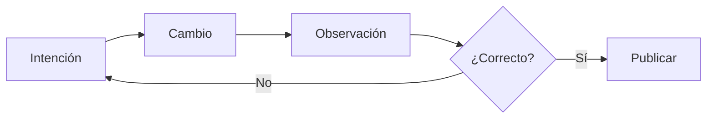

Un ciclo de desarrollo productivo responde rápidamente una pregunta: **¿el cambio hizo lo que yo pretendía?**

El ciclo se vuelve lento cuando cada paso introduce decisiones que no están relacionadas. Iniciar cinco servicios, encontrar el comando de pruebas correcto, preparar datos y reconstruir estado oculto retrasan la retroalimentación útil.

## Un ciclo sencillo

1. Define el comportamiento que quieres obtener.
2. Haz el cambio más pequeño que podría producirlo.
3. Observa el resultado mediante una prueba o la interfaz.
4. Conserva o revisa el cambio.

## Optimiza para entender

Los milisegundos importan en operaciones que se repiten con frecuencia, pero la claridad suele importar primero. Una suite que inicia en dos segundos y produce un error ambiguo puede costar más atención que una que inicia en cinco y señala directamente el contrato roto.

Mide el recorrido completo desde la pregunta hasta la confianza. Ese es el ciclo de desarrollo que vale la pena mejorar.
