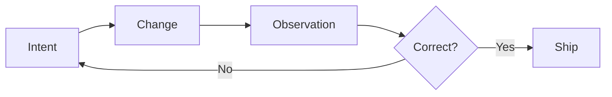

A productive development loop answers one question quickly: **did the change do what I intended?**

The loop becomes slow when each step introduces unrelated decisions. Starting five services, finding the right test command, preparing data, and reconstructing hidden state all delay the useful feedback.

## A simple loop

1. State the behavior you want.
2. Make the smallest change that could create it.
3. Observe the result through a test or the interface.
4. Keep or revise the change.

## Optimize for understanding

Milliseconds matter in frequently repeated operations, but clarity usually matters first. A test suite that starts in two seconds and gives an ambiguous failure can cost more attention than one that starts in five seconds and points directly at the broken contract.

Measure the whole path from question to confidence. That is the development loop worth improving.
